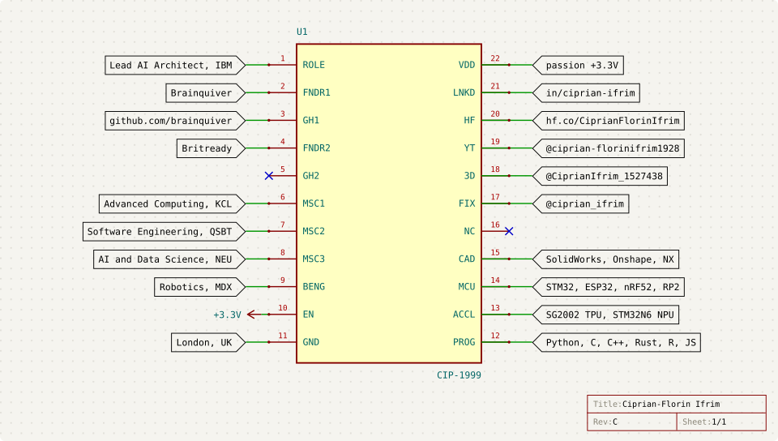

  <picture>
    <source media="(prefers-color-scheme: dark)" srcset="assets/chip-dark.svg">
    
  </picture>

  <picture>
    <source media="(prefers-color-scheme: dark)" srcset="assets/boot-log-dark.svg">
    
  </picture>
  

